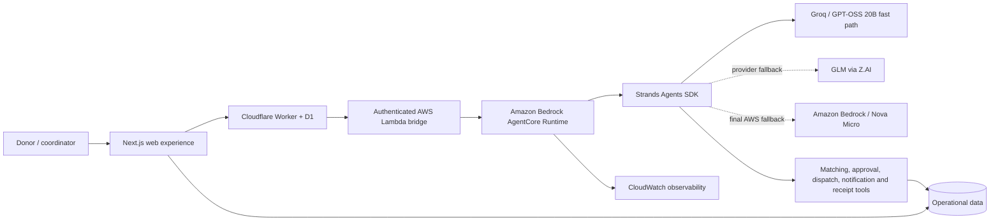

# FoodBridge

**From surplus to support—before time runs out.**

FoodBridge is an autonomous food-rescue coordinator built for the AWS Agents for Humans Hackathon. It matches time-sensitive surplus food with qualified community organizations, pauses for the one decision that needs a person, then coordinates recipient acceptance, driver dispatch, notifications, and the impact receipt end to end.

## Why it matters

The food often exists, the recipient often has demand, and a volunteer may be nearby. The failure is coordination: capacity, cold storage, deadlines, calls, rejections, and handoffs all have to line up quickly. FoodBridge turns that frantic chain of work into one approval.

## Working workflow

1. A donor enters the food type, quantity, area, collection deadline, and refrigeration requirement.
2. The agent applies deterministic food-safety and capacity constraints.
3. It ranks eligible community partners by distance and reliability.
4. The operator approves the proposed recipient.
5. The agent reserves recipient capacity, assigns a compatible driver, and notifies all parties.
6. If the first recipient is unavailable, the recovery workflow selects the next safe candidate.
7. Once the handoff is confirmed, FoodBridge closes the rescue and creates an impact receipt.

All listed organizations and people are synthetic prototype data; rescue totals and history are created only by completed user-driven workflows.

## Architecture



The agent implementation lives in [`agent/`](agent/). The deployable AgentCore CodeZip project lives in [`FoodBridgeAgentCore/`](FoodBridgeAgentCore/). The routing order is Groq GPT-OSS 20B for low latency, GLM as the secondary provider, and Amazon Nova Micro as the final AWS fallback. Each request receives a fresh Strands session, and the browser never receives model credentials. See [`docs/ARCHITECTURE.md`](docs/ARCHITECTURE.md) for the trust boundary and demo/deployed modes.

## Run the web application

Requirements: Node.js 22.13 or newer.

```bash
npm install
npm run dev
```

Open `http://localhost:3000`. The local Cloudflare binding creates the D1 development database and loads the synthetic recipient/driver network. Connect the local AgentCore endpoint to exercise live model calls; the interface reports the agent as unavailable rather than substituting canned AI answers when no runtime is connected.

Useful commands:

```bash
npm run build
npm run lint
npm run db:generate
npm run test:agent
```

## Deploy the website to Cloudflare

The web application is prepared for Cloudflare Workers and D1. The first deployment requires a free Cloudflare account and one browser authorization:

```bash
npm run cloudflare:login
npm run cloudflare:db:create
```

Add the returned database ID to the `DB` binding in `wrangler.jsonc`, then run:

```bash
npm run cloudflare:db:migrate
npm run deploy:cloudflare
```

Cloudflare returns a public `workers.dev` URL. To connect it securely to AgentCore without exposing AWS credentials, deploy the scoped Lambda bridge and install its URL/shared secret as encrypted Worker secrets:

```bash
FOODBRIDGE_NODE_BIN=/path/to/node-22 ./scripts/deploy-agentcore-bridge.sh
npm run deploy:cloudflare
```

The production site at `https://foodbridge.byshameem.space` uses this route. Model credentials stay in AgentCore Identity and never reach the browser or Cloudflare database.

## Run the Strands agent

Requirements: Python 3.13+ and provider credentials. Groq is the fast path, GLM is secondary, and AWS credentials enable the final Nova Micro fallback.

```bash
cd agent
uv sync
uv run python main.py
```

Provider model IDs can be changed through the documented environment variables. See [`agent/.env.example`](agent/.env.example).

For local testing, put rotated provider credentials only in an untracked environment. Never commit them. FoodBridge tries Groq first, GLM second, and Bedrock only when both external providers are unavailable. Successful responses include `model_provider` and `fallback_used` metadata.

Test the local AgentCore invocation contract:

```bash
curl -X POST http://localhost:8080/invocations \
  -H "Content-Type: application/json" \
  -d '{"prompt":"Coordinate 60 refrigerated meals in Salmiya before 9 PM."}'
```

## Deploy the agent to AgentCore Runtime

`FoodBridgeAgentCore/` is an AgentCore CLI project already configured as a Python, Strands, CodeZip runtime. From that directory:

```bash
npm install -g @aws/agentcore
cd FoodBridgeAgentCore
agentcore validate
agentcore deploy
```

Then invoke the deployed runtime:

```bash
agentcore invoke "Coordinate 60 refrigerated meals in Salmiya before 9 PM."
```

The generated runtime role must be permitted to invoke the chosen Bedrock model and write CloudWatch logs. Store rotated Groq and GLM keys in AgentCore Identity under `foodbridge-groq` and `foodbridge-glm`; keys must never be placed in `agentcore.json`. For the hosted website, use `scripts/deploy-agentcore-bridge.sh` to install the authenticated bridge URL and secret in Cloudflare rather than exposing AWS credentials.

## Project structure

```text
app/                 Web UI and live workflow API
agent/               Strands agent and AgentCore entrypoint
db/                  D1/SQLite schema and initialization
docs/                 Architecture and safety notes
infra/                Scoped AWS bridge infrastructure
public/og.png         Branded social/submission preview
```

## Safety and human control

- Capacity and refrigeration requirements are deterministic tool constraints, not optional model suggestions.
- Recipient contact happens only after operator approval.
- A delivery is never recorded until the handoff is confirmed.
- The fallback workflow moves only to another qualified recipient.
- Listed recipients and drivers are synthetic; no sensitive beneficiary data is collected.

## Suggested five-minute demo

1. **Problem (30 sec):** surplus food expires while coordinators make calls.
2. **Create donation (60 sec):** enter a refrigerated donation and show automatic ranking.
3. **Human control (45 sec):** explain the match and approve it.
4. **Autonomous execution (60 sec):** show recipient acceptance, driver assignment, and notifications.
5. **Recovery (45 sec):** run the fallback demo when a recipient is unavailable.
6. **Impact and architecture (60 sec):** confirm delivery, show impact metrics, Strands tools, and AgentCore observability.

## License

MIT
