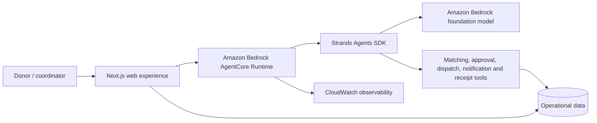

# FoodBridge

**From surplus to support—before time runs out.**

FoodBridge is an autonomous food-rescue coordinator built for the AWS Agents for Humans Hackathon. It matches time-sensitive surplus food with qualified community organizations, pauses for the one decision that needs a person, then coordinates recipient acceptance, driver dispatch, notifications, and the impact receipt end to end.

## Why it matters

The food often exists, the recipient often has demand, and a volunteer may be nearby. The failure is coordination: capacity, cold storage, deadlines, calls, rejections, and handoffs all have to line up quickly. FoodBridge turns that frantic chain of work into one approval.

## Working workflow

1. A donor enters the food type, quantity, area, collection deadline, and refrigeration requirement.
2. The agent applies deterministic food-safety and capacity constraints.
3. It ranks eligible community partners by distance and reliability.
4. The operator approves the proposed recipient.
5. The agent reserves recipient capacity, assigns a compatible driver, and notifies all parties.
6. If the first recipient is unavailable, the recovery workflow selects the next safe candidate.
7. Once the handoff is confirmed, FoodBridge closes the rescue and creates an impact receipt.

All organizations, people, and activity in the public demo are synthetic.

## Architecture



The agent implementation lives in [`agent/`](agent/). It uses Strands with a Bedrock model and exposes the AgentCore Runtime entrypoint. The browser never receives AWS credentials. See [`docs/ARCHITECTURE.md`](docs/ARCHITECTURE.md) for the trust boundary and demo/deployed modes.

## Run the web application

Requirements: Node.js 22.13 or newer.

```bash
npm install
npm run dev
```

Open `http://localhost:3000`. The local Cloudflare binding automatically creates and seeds the D1 development database. The interface is intentionally usable in transparent demo mode so judges can exercise the complete workflow without AWS or messaging credentials.

Useful commands:

```bash
npm run build
npm run lint
npm run db:generate
npm run test:agent
```

## Run the Strands agent

Requirements: Python 3.13+, AWS credentials, and Amazon Bedrock model access.

```bash
cd agent
uv sync
uv run python main.py
```

The default model ID can be changed with `BEDROCK_MODEL_ID`. See [`agent/.env.example`](agent/.env.example).

Test the local AgentCore invocation contract:

```bash
curl -X POST http://localhost:8080/invocations \
  -H "Content-Type: application/json" \
  -d '{"prompt":"Coordinate 60 refrigerated meals in Salmiya before 9 PM."}'
```

## Deploy the agent to AgentCore Runtime

The current AWS AgentCore CLI supports direct Python CodeZip deployments:

```bash
npm install -g @aws/agentcore
agentcore create \
  --project-name FoodBridge \
  --name FoodBridgeAgent \
  --language Python \
  --framework Strands \
  --model-provider Bedrock \
  --memory none \
  --build CodeZip
```

Replace the generated agent package with the contents of `agent/`, enable observability if desired, then deploy and invoke:

```bash
agentcore deploy
agentcore invoke "Coordinate 60 refrigerated meals in Salmiya before 9 PM."
```

The generated runtime role must be permitted to invoke the chosen Bedrock model and write CloudWatch logs. Put the deployed runtime URL in the web environment as `AGENTCORE_RUNTIME_URL`; keep runtime credentials server-side.

## Project structure

```text
app/                 Web UI and persistent demo API
agent/               Strands agent and AgentCore entrypoint
db/                  D1/SQLite schema and initialization
docs/                 Architecture and safety notes
public/og.png         Branded social/submission preview
```

## Safety and human control

- Capacity and refrigeration requirements are deterministic tool constraints, not optional model suggestions.
- Recipient contact happens only after operator approval.
- A delivery is never recorded until the handoff is confirmed.
- The fallback workflow moves only to another qualified recipient.
- Public demo data is synthetic; no sensitive beneficiary data is collected.

## Suggested five-minute demo

1. **Problem (30 sec):** surplus food expires while coordinators make calls.
2. **Create donation (60 sec):** enter a refrigerated donation and show automatic ranking.
3. **Human control (45 sec):** explain the match and approve it.
4. **Autonomous execution (60 sec):** show recipient acceptance, driver assignment, and notifications.
5. **Recovery (45 sec):** run the fallback demo when a recipient is unavailable.
6. **Impact and architecture (60 sec):** confirm delivery, show impact metrics, Strands tools, and AgentCore observability.

## License

MIT
