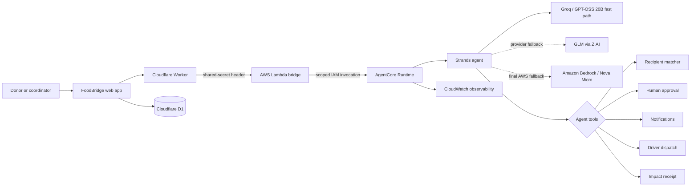

# FoodBridge architecture

## Trust boundary

The browser never receives AWS, Groq, or GLM credentials. The Cloudflare Worker calls a dedicated Lambda Function URL with an encrypted shared secret; that Lambda role can invoke only the FoodBridge AgentCore runtime endpoint. AgentCore runs the Strands loop under its scoped IAM role. Every invocation gets a fresh Strands session to prevent conversation or tool history from leaking between rescues. Groq handles the low-latency path, GLM provides secondary resilience, and Nova Micro is attempted only as the final AWS fallback. External keys come from untracked local variables or AgentCore Identity. Deterministic tools enforce capacity and refrigeration constraints before a candidate can be recommended. Contacting a recipient requires explicit operator approval; recording a delivery requires handoff confirmation.

## Deployed behavior

The hosted interface uses the deployed Strands implementation for every chat and rescue transition. If the AgentCore route is unavailable, it returns a visible error and does not fabricate a model answer. Cloudflare D1 persists donation states, exact completion timestamps, agent summaries, selected providers, and the activity trail. Listed partners and drivers are synthetic prototype records; impact counters start at zero and increase only after an operator confirms a handoff.
