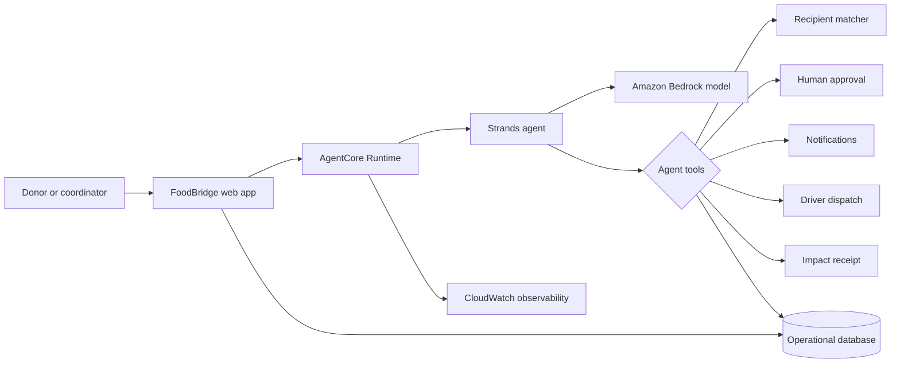

# FoodBridge architecture

## Trust boundary

The browser never receives AWS credentials. AgentCore runs the Strands loop under a scoped IAM role. Deterministic tools enforce capacity and refrigeration constraints before a candidate can be recommended. Contacting a recipient requires explicit operator approval; recording a delivery requires handoff confirmation.

## Demo mode versus deployed mode

The hosted interface includes a deterministic, auditable demo workflow backed by persistent storage, so judges can test every state without third-party accounts. The `agent/` service is the production Strands implementation for AgentCore Runtime. Once its runtime URL and authentication are configured, the UI can route orchestration requests to that endpoint while keeping the same interface and safety gates.
